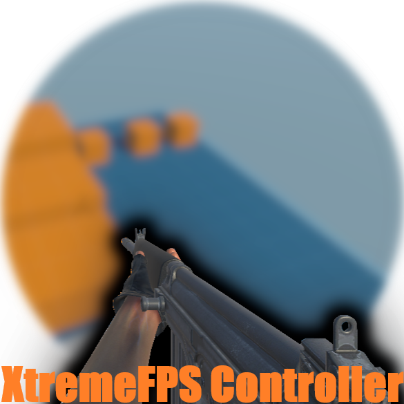

# XtremeFPS Controller

   

## Table Of Content:
- [XtremeFPS Controller](#xtremefps-controller)
  - [Table Of Content:](#table-of-content)
  - [Description:](#description)
  - [Installation:](#installation)
    - [Method 1:](#method-1)
    - [Method 2:](#method-2)
  - [How to Use:](#how-to-use)
    - [Method 1 (Prefabs):](#method-1-prefabs)
    - [Method 2 (Scratch):](#method-2-scratch)
      - [Without Gun:](#without-gun)
      - [With Gun:](#with-gun)
      - [UI:](#ui)
  - [Credits:](#credits)
  - [Contact Me:](#contact-me)

## Description:

An advance yet easy to use and modify First Person Prespective based character controller which intends to reduce developement time and provide realistic experience to player using procedural animation + support for pre-baked animations.

## Installation:
 ### Method 1: 
 1. Download the [Unity Package](https://github.com/SpoiledUnknown/Xtreme-FPS-Controller/releases/tag/version-1.5.1).
 2. Open the project where you want to use this asset.
 3. Double click the "Unity Package" or Drag and Drop the "Unity Package" to the open unity editor.
 4. Install all the packages
 5. Go to `window -> Spoiled Unknown -> XtremeFPS`.
 6. Click on `System Installs`.
 7. Install both `Cinemachine` And `Input System`.
    - You can also use package manager to install these packages.
 8. If unity editor prompts, then proceed by selecting new input system.
    - If you have any doubt, or unity doesn't prompt then,
        1. Go to `Edit -> Project Settings -> Player -> Others -> Active Input Handling`.
        2. Then select `Input System Package (New)` or `Both`.
            - It is highly recommended that you should use `Input System (New)` rather than `Input Manager (Old)` and upgrade any existing script which relies on Old Input Manager.

9. All done, now you can either use prefabs or create one from scratch

### Method 2:
1. Download the source code from [here](https://github.com/SpoiledUnknown/Xtreme-FPS-Controller/releases/tag/version-1.5.1).
2. Go inside the source code, then go inside `Asset`.
3. Copy `Spoiled Unknown` folder.
4. Paste in your current project.
5. Open Unity Editor.
6. Wait for the Editor to import and compile the new codes.
7. Go to `window -> Spoiled Unknown -> XtremeFPS`.
8. Click on `System Installs`.
9. Install both `Cinemachine` And `Input System`.
    - You can also use package manager to install these packages.
10. If unity editor prompts, then proceed by selecting new input system.
    - If you have any doubt, or unity doesn't prompt then,
        1. Go to `Edit -> Project Settings -> Player -> Others -> Active Input Handling`.
        2. Then select `Input System Package (New)` or `Both`.
            - It is highly recommended that you should use `Input System (New)` rather than `Input Manager (Old)` and upgrade any existing script which relies on Old Input Manager.

11. All done, now you can either use prefabs or create one from scratch

## How to Use:
### Method 1 (Prefabs):
1. Go to `window -> Spoiled Unknown -> XtremeFPS`.
2. Click on `Layer And Tag Setup`.
3. Click on `Create Layers` and `Create Tags`.
4. Go to `Spoiled Unknown -> First Person Controller -> Prefabs -> Player`.
5. Click on desired folder (Depends on whether you need weapon system or not).
6. Drag and Drop the prefab.
7. Change the values as you want.

### Method 2 (Scratch):
_Note: This method is longer but is rewarding since it gives you more control over the player created._
#### Without Gun:

1. Create an Empty GameObject *(lets call it Player)*.
2. Create a `CinemachineVirtualCamera` as child of *Player* (*lets call it Player Camera*).
   - This should automatically upgrade the main camera to a `CinemachineBrain` if not then create it as child of our *Player*.
3. Create an Empty GameObject as child of *Player*, *(lets call it Player Armature)*.
4. Add `First Person Controller` class to *Player Armature*, this should aslo add `Character Controller`, `Audio Source` and `FPS Input Manager` components to it. Set all the values
    - You can hover over any field to know more about it and what to set there.
    - You can use the provided prefabs to find the right values as well.
5. Create an Empty Child inside *Player Armature*, named `Ground Check`, Place it near about the *Player Armature's* leg position or a little above ground.  
   - *Check the provided prefab for better understanding*
   - Select all the gameobject on which you want the player to walk and give them `Ground` layer.
6. Create another Empyt Child inside *Player Armature*, named Camera Holder.
7. Create an Empyt Child inside *Camera Holder*, (*lets name it Camera Follow)*.
8. Drag and Drop *Camera follow* on `Follow` field of `CinemachineVirtualCamera` which we create a sshort while ago, Now on *VirtualCamera*:
   - Set body to `Hard Lock To Target`.
   - Set Aim to `Same As Follow Target`.
  
 ***Note: The Basic setup of player is done, if you don't want shooting and weapon system then you are good to go and can start working on other feature else you can continue.***

#### With Gun:
1. After following everything mention [above](#without-gun) then congrats, we now continue to the hardest part.
2. Create a Child of *Camera Holder*, lets call it `Camera Recoil`, and Drag and Drop the *Camera Follow* inside the newly created child.
3. Now create another Child but inside *Camera Follow*, name it Weapon Holder
   

4. Create more Empty Children just like above shown image.
5. Add `Weapon System` script to *Weapon Model*.
6. Set all the values, you can use provided prefabs for refference and help.
7. Drag and Drop you weapon to *Weapon Model GameObject*
8. Create 2 more Empty Child inside *Weapon Model*, and set there position accordingly.
   -  *Shoot Point* should be placed at the position of muzzle.
   -  Shell Ejector should be placed at the point where bullet shell will me ejected.
   
  

#### UI:
 ***Since UI is mostly automatic you can just drag and drop all desired prefabs from the UI prefab location inside prefabs.***

## Credits:
- Gun Model Provied in Package:
   - [Battle Rifle Animated](https://skfb.ly/o6QuA) by DJMaesen is licensed under [Creative Commons Attribution-ShareAlike](http://creativecommons.org/licenses/by-sa/4.0/).
  
***Note: I will try to put all this steps into a easy to understand video, although it might look hard at first but once you do it for first time you can then easily setup this controller 2nd time.***

## Contact Me:

If you have any issues, or just wanna ask for help then join the [discord community](https://discord.gg/YykdmCjzmQ).
